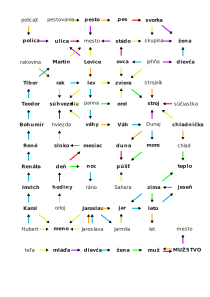

Autor: Janči

V šifre vidíme množstvo farebných šípok spájajúcich slová a otázniky.
Zrejme teda namiesto každého otáznika treba tiež doplniť slovo.
Na spodku sa nachádza postupnosť šípok,
ktorá začína slovom TEĽA a končí sa heslom,
ktoré okrem toho nejako súvisí so slovom MESTO.
Potrebujeme teda prísť na to, čo jednotlivé šípky znamenajú.

Vyzerá to tak, pri šípkach nezáleží na orientácii
ani na vzájomnom križovaní sa,
dôležitá je iba ich farba a smer (odkiaľ kam vedú).
Tiež môžeme predpokladať, že všetky slová sú zmysluplné
a sú to podstatné mená -- pretože všetky slová v zadaní to spĺňajú.
Nie všetky podstatné mená sú ale všeobecné, niektoré sú vlastné.

Pochopiť jednotlivé farby sa dá najlepšie tak,
že skúsime vymýšľať, čo by mohli znamenať, hľadať miesta, kde to nesedí,
všímať si vzory v použití šípok a používať tie,
pre ktoré už máme rozumnú predstavu, na doplnenie slov v otáznikoch.
Je to teda dosť nepriamočiary proces,
ktorý vyžaduje množstvo nápadov
a každý na výsledné významy môže prísť v inom poradí.
Napriek tomu tu jednu možnú postupnosť pozorovaní
(bez slepých uličiek) popíšeme:

Pozrime sa najskôr na modré šípky na ľavom kraji.
Tvoria dlhú postupnosť začínajúce slovom HUBERT,
ktorá pokračuje ôsmymi modrými šípkami k slovu,
ktoré súvisí (žltou šípkou) so slovom MESTO.
Akú transformáciu vieme aplikovať osemkrát po sebe?
Môže to byť niečo, kde sa slová dookola striedajú,
alebo niečo, kde slová z podobnej kategórie nasledujú prirodzene za sebou.
Modrá šípka sa používa aj medzi slovami JAROSLAVA → ? → JARMILA,
mieri do slova RÁNO a zo slova JAHŇA.
JAHŇA je podozrivé, pretože ide o mláďa OVCE,
RÁNO je zase časť dňa (po NOCI)
a mená sa nachádzajú v kalendári, dokonca s konkrétnym dátumom.
Modrá šípka teda zjavne vyjadruje určitú (časovú) následnosť.
To nám umožní doplniť slovo nad JAROSLAVOU -- JAROSLAV --
a na konci reťazca od HUBERTA -- MARTIN.
Čo však s PANNOU, DUNAJOM a cyklom štyroch vecí, ktoré po sebe nasledujú?
Uvidíme.

Všimneme si, že MARTIN je zároveň názov mesta, na čo nám ukazuje žltá šípka.
Zamerajme sa teda na ňu.
Na spodku ukazujú rôzne mená žltými šípkami na to isté slovo,
to by mohlo byť MENO -- HUBERT je MENO, MARTIN je MESTO,
JAHŇA aj OVCA je ZVIERA, SAHARA je PÚŠŤ.
Žltá teda hovorí o prechode z konkrétneho na všeobecné.
ORLOJ sú HODINY.

Poďme teraz na oranžovú. Z JAROSLAVY vzniká JAROSLAV,
z neho (a rovnako z JARMILY) vzniká niečo,
čo je vo štvorcykle so vzájomnou časovou následnosťou.
Hneď po tomto slove je ďalšie, z ktorého vzniká LET.
Okrem toho ostatné slová, z ktorých vedú oranžové šípky,
obsahujú v sebe iné slová, a to dokonca hneď na začiatku.
Od neho o dve slová ďalej niečo, čo vzdialene súvisí s chladom.
Tu si uvedomíme, že štvorcyklus sú ročné obdobia: JAR, LETO, JESEŇ, ZIMA.
Oranžová šípka je teda prefix -- slovo skrátené od konca.
Zo STROJNÍKA teda vznikne STROJ, druh stroja,
ktorý sa skracuje na CHLAD, je CHLADNIČKA, DUNAJ sa skráti na DUNU
a RAKOVINA na RAKA.
Z POLICAJTA vznikne POLICA, z PESTOVANIA najskôr PESTO a potom PES --
to nám dokonca ukazuje, že berieme vždy najdlhší prefix,
ktorý tvorí rozumné slovo.

Reťaz modrých šípok so slovom PANNA teda obsahuje aj slovo RAK
a nejaké ďalšie zviera.
Všetky sú tej istej kategórie, ktorá súvisí s HVIEZDOU.
Sú to teda SÚHVEZDIA -- RAK, LEV, PANNA, VÁHY.
VÁHY sa skrátia na VÁH, po ňom nasleduje DUNAJ a po ňom
(keďže DUNAJ sa do inej rieky nevlieva) MORE (konkrétne Čierne more).
Pozrime sa teraz na červenú šípku.
Spája dvojice HVIEZDA → SǓHVEZDIE, DUNA → PÚŠŤ, SÚČIASTKA → STROJ.
Teda také, kde sa vždy druhá vec skladá z (nejakého počtu) prvej veci.
Z OVIEC sa skladá STÁDO, zo PSOV SVORKA, obe sú konkréty druh SKUPINY.

Skúsme zelenú šípku.
Spája ZIMU a LETO, ale aj ZIMU a niečo, na čo zároveň mieri CHLAD.
Tiež MORE s PÚŠŤOU a ZVIERA so STROJOM.
Táto šípka teda jednoducho vyjadruje opak.
HODINY tvoria DEŇ, ten je opak NOCI, DNI tvoria MESIAC, opak SLNKA,
ktoré je HVIEZDA.

Zostala nám teda už len fialová šípka.
Spája DUNAJ a STROJ, PESTO a MESTO, STÁDO a MESTO.
Majú podobné koncovky, prvé dve sa dokonca celkom rýmujú.
Tiež spája JAHŇA s niečim, čo sa postupom času zmení na slovo,
na ktoré potom mieri zo SVORKY aj SKUPINY.
A nakoniec niečo, z čoho je tvorené MESTO,
a mieri na to zo slova POLICA a zo slova,
ktoré je tiež MESTOM (ako MARTIN) a začína sa na LEV.
Keď si uvedomíme, že mesto sa skladá (okrem iného) z ULÍC,
prídeme aj na to, čo majú slová MESTO, STROJ a ULICA spoločné -- ide o vzory.
POLICA je vzoru ULICA, takisto LEVICE (pomnožné).
PESTO aj STÁDO sú vzoru MESTO,
zatiaľ čo JAHŇA je vzoru DIEVČA a SVORKA aj SKUPINA sú vzoru ŽENA.

Nakoniec zvládneme doplniť postupnosť až k heslu:

TEĽA → ZVIERA → DIEVČA → ŽENA → MUŽ → **MUŽSTVO** → MESTO

Takto vyzerá obrázok s doplnenými slovami:

{style="width:200mm}
