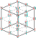

Autor: Matea

Šifra pozostáva z dvoch častí, zo šesťuholníkov s obrázkami a šípkami a z hlavy dieťaťa, ktoré nám niečo hovorí.
Každý obrázok obsahuje iba jednu, celkom jednoznačne pomenovateľnú vec.
Skúsme si ich teda pomenovať.
Po riadkoch zhora nadol a v rámci riadku zľava doprava to je:

- box
- chlieb
- duha
- fixka
- guma
- holub
- jablko
- krab
- prak
- syr
- tequila
- trieda
- vazen
- whisky
- word

Môžeme si všimnúť, že počet bodiek v šesťuholníku je rovnaký ako počet písmen pomenovania daného obrázku (toto nám vie pomôcť pomenovať obrázky).
To nás môže naviesť k tomu, týmto bodkám priradiť písmená z pomenovanie po smere šípky.

Teraz si môžeme všimnúť, že rovnaké písmená sa nachádzajú na rovnakých bodkách.
Takže, každý šesťuholník je vlastne iba pohľad na časť nejakého objektu.
V našich slovách sa každé písmeno abecedy nachádza aspoň raz, takže by sme chceli na tento náš neznámy objekt namapovať celú abecedu.

Keď sa pozrieme na šesťuholník, tak ten nám môže pripomínať pohlad na kocku z istého uhla.
Teraz by sa nám hodilo zistiť, kde by sa naše body zo šesťuholníkov mali nachádzať.
Je ich 26, sú to vrcholy (8), stredy hrán (12) a stredy strán (6).

Teraz nám už stačí priradiť k bodom písmená.
Pri dopĺňaní nám vie pomôcť to, že čiary, ktoré idú vnútrom kocky sú v šifre prerušované.

{style="width:70mm}

Máme už vyplnenú kocku, ale čo s ňou?
Na to použijeme hlavu dieťaťa.
Tá nám hovorí: `styri pismenka heslo vyskladaju`.
Môžeme si všimnúť, že celá veta je bez diakritiky ako naše písmená v kocke.
Veta má 4 slová, takže každé slovo nám dáva jedno písmeno.
Každé slovo má iba unikátne písmená, takže ich môžeme napísať do kocky.

Dieťa sa na kocky nepozerá tak ako my, ale pozerá sa priamo na predné steny kociek.
Pozrime sa teda aj my na prednú stenu kocky.
Z tohto uhla pospájané písmená tvoria štyri písmená a môžeme prečítať heslo **LEGO**.

{style="width:70mm}
