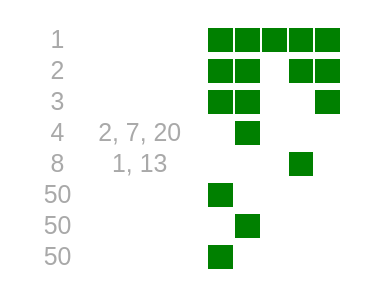

Autor: Janči

Keď sme si otvorili túto šifru na začiatku kola, mala iba nadpis,
odkaz na stránku a veľké prázdne miesto v strede.
Čoskoro sa ale prostredná časť stránky začala meniť a začal pribúdať obsah.

Takto napríklad vyzerala pár hodín pred zverejnením nápovied:

{style="width:100mm}

Keďže šifra sa mení, bude zjavne podstatné,
ako vyzerala v rôznych časoch.
Musíme teda sledovať, ako sa mení, ukladať si jej rôzne verzie a dúfať,
že z toho postupne zistíme všetky informácie potrebné na jej vyriešenie.

Rýchlo si všimneme, že ide o tabuľku, ktorá má tri stĺpce:

- V prvom sú čísla od približne 1 do pár desiatok.
- Druhý je buď prázdny, alebo obsahuje niekoľko čísel
(občas jedno, občas viac oddelených čiarkami).
- Tretí obsahuje päť štvorčekov, ktoré su väčšinou biele, občas sú ale zelené.

Sledujme, čo sa so šifrou v priebehu času deje:

- Riadky iba pribúdajú a nemiznú. V každom riadku je aspoň jeden zelený štvorec.
- Obsah v treťom stĺpci (zelené štvorce) tiež iba pribúda.
- Ďalšie dva stĺpce sa ale menia, a to vždy naraz s pribudnutím štvorca.
- Čísla v prvom stĺpci sa s pribúdajúcimi štvorcami zmenšujú.
- Riadky sa ale občas vymenia a vtedy sa čísla v prvom stĺpci vymeneného riadku zväčšia.
- To je zároveň jediný prípad, kedy sa zmena v jednom riadku prejaví na inom riadku.
- n-tice čísel v druhom stĺpci sa objavujú a miznú s pribúdajúcimi štvorčekmi dosť nepravidelne.

Niektoré čísla v n-ticiach sa vždy vyskytujú spolu, konkrétne:

- 1 a 13
- 2, 7 a 20
- 3, 5 a 10
- 6 a 15
- 12 a 16
- 18 a 21

Ostatné čísla sa vždy vyskytujú samostatne.
21 je zároveň najvyššie číslo, ktoré sa v tabuľke nachádza.
Čísla by teda mohli reprezentovať písmená tajničky,
ktoré nám v danej chvíli napovedá každý riadok.

Ešte dôležitejšie, než všimnúť si, čo sa so šifrou deje,
je všimnúť si kedy sa to deje.
Napríklad najviac sa mení na začiatku kola, občas sa s ňou celé dni nedeje nič,
a po zverejnení nápovied sa zmení výrazne.
A potom, čo odovzdáme riešenie inej šifry a všimneme si zmenu takmer okamžite,
je nám už jasné, že v šifre je zobrazená
[výsledkovka tohto objavného kola](https://susi.trojsten.sk/vysledky/513/Z%C3%A1sielkov%C5%88a/).

V prvom stĺpci je poradie, v poslednom vyriešené úlohy.
Takže už stačí len prísť na to, ako získať heslo z druhého stĺpca každého riadku.
Čo tam chýba a nachádza sa vo výsledkovke?
Niekoľko rôznych údajov, no najpodstatnejšie je predsa meno a priezvisko riešiteľa!

Ako z neho vyberáme písmená?
Zjavne sa to mení s pribúdajúcimi štvorčekmi.
Štvorčekov je 5, rovnako ako úloh, čo navádza na vyskúšanie binárneho kódovania.
To naozaj funguje, konkrétne prvá šifra má hodnotu 1, druhá 2, tretia 4, štvrtá 8 a posledná (táto) 16.
Keď sčítame hodnoty vyriešených úloh každého riešiteľa v tabuľke a vyberieme toľké písmeno z jeho mena,
pozície tohto písmena v tajničke sa zobrazia v druhom stĺpci.
Pokiaľ tam žiadne čísla nie sú, vieme, že toto písmeno sa v tajničke nenachádza
(čo nám dosť pomôže doplniť časti tajničky, ktoré sme prepásli alebo sa neukázali).
Pokiaľ je meno príliš krátke, žiadne písmeno z neho nezískame.

Dostaneme teda tajničku RIESENIM JE **KORUNOVACIA**.

*Po zverejnení nápovied sme si mohli všimnúť, že v tabuľke sú aj ďalšie farby okrem zelenej.
Každý submit za menej než 9, ale viac než 6 bodov, bol žltý.
Každý submit za menej než 7, ale viac než 4 body (po zverejnení veľkých nápovied) bol oranžový.
Ak niekto odovzdal príliš veľa nesprávnych riešení na niektorú šifru a mal ešte menej než 5 bodov,
tento submit bol dokonca červený.*
